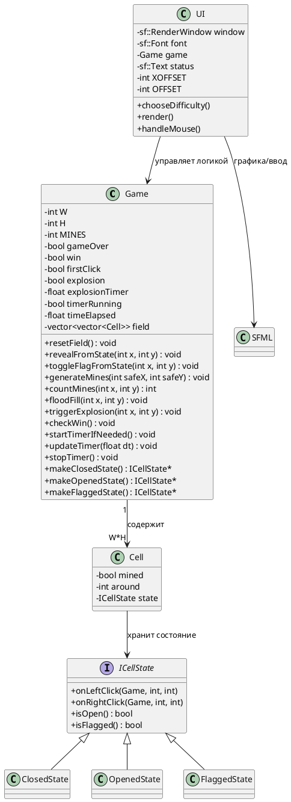

```plantuml
@startuml
skinparam backgroundColor #ffffff
skinparam classAttributeIconSize 0
skinparam classBorderColor #333333
skinparam classFontColor #111111

'===========================
' КЛАСС GAME
'===========================
class Game {
  -int W
  -int H
  -int MINES
  -bool gameOver
  -bool win
  -bool firstClick
  -bool explosion
  -float explosionTimer
  -bool timerRunning
  -float timeElapsed
  -vector<vector<Cell>> field

  +resetField() : void
  +revealFromState(int x, int y) : void
  +toggleFlagFromState(int x, int y) : void
  +generateMines(int safeX, int safeY) : void
  +countMines(int x, int y) : int
  +floodFill(int x, int y) : void
  +triggerExplosion(int x, int y) : void
  +checkWin() : void
  +startTimerIfNeeded() : void
  +updateTimer(float dt) : void
  +stopTimer() : void
  +makeClosedState() : ICellState*
  +makeOpenedState() : ICellState*
  +makeFlaggedState() : ICellState*
}

'===========================
' КЛАСС CELL
'===========================
class Cell {
  -bool mined
  -int around
  -ICellState state
}

Game "1" --> "W*H" Cell : содержит

'===========================
' ПАТТЕРН STATE
'===========================
interface ICellState {
  +onLeftClick(Game, int, int)
  +onRightClick(Game, int, int)
  +isOpen() : bool
  +isFlagged() : bool
}

class ClosedState
class OpenedState
class FlaggedState

ICellState <|-- ClosedState
ICellState <|-- OpenedState
ICellState <|-- FlaggedState

Cell --> ICellState : хранит состояние

'===========================
' UI / SFML
'===========================
class UI {
  -sf::RenderWindow window
  -sf::Font font
  -Game game
  -sf::Text status
  -int XOFFSET
  -int OFFSET

  +chooseDifficulty()
  +render()
  +handleMouse()
}

UI --> Game : управляет логикой
UI --> "SFML" : графика/ввод

@enduml
```
